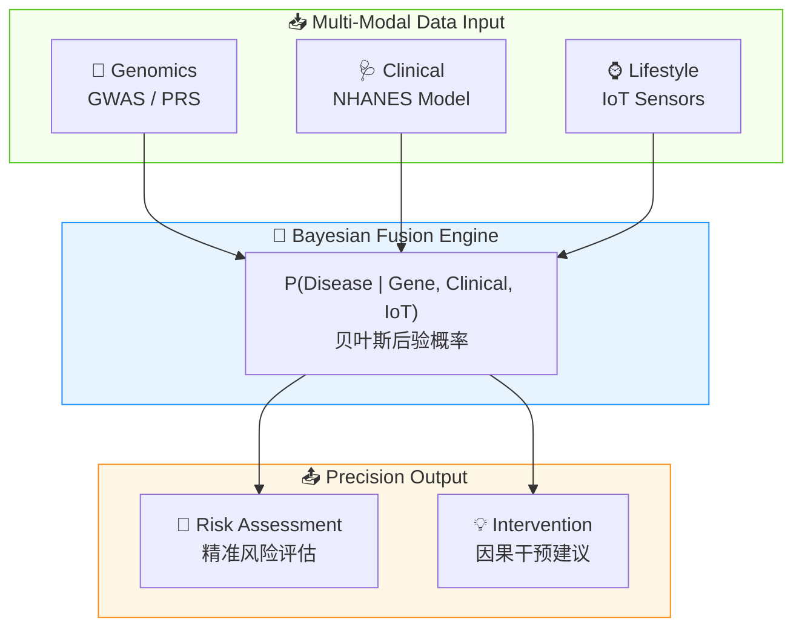
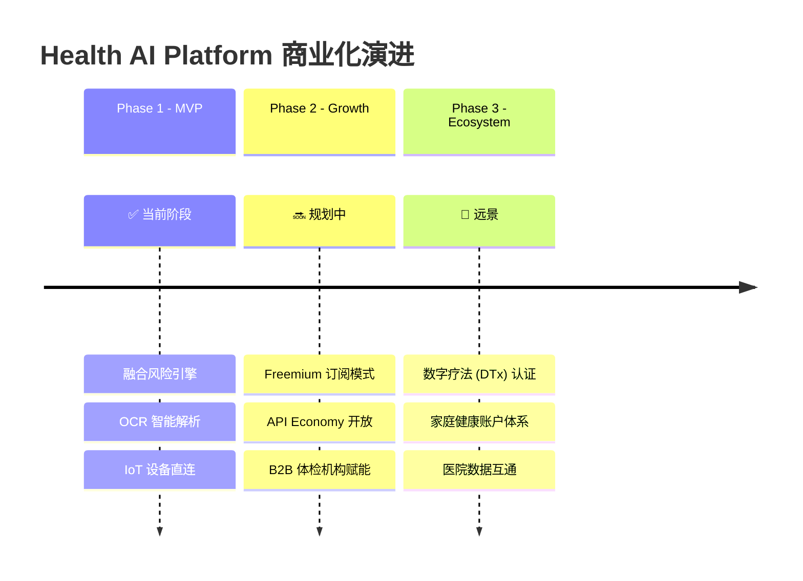
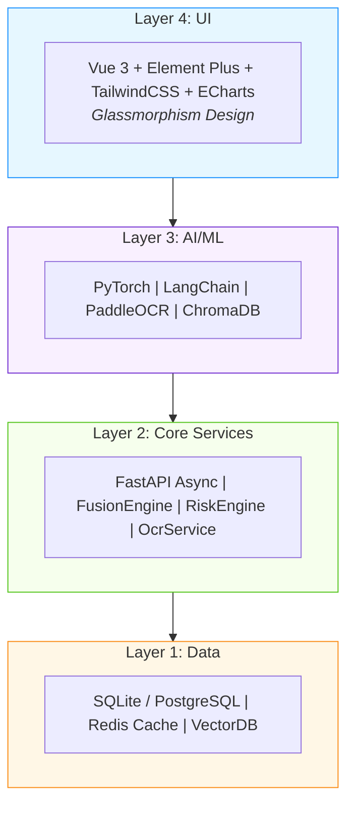

<


<br>

<!-- 状态与License -->


<br>

[📖 API Docs](http://localhost:8000/docs) · [🐛 Report Bug](https://github.com/your-username/health-ai-platform/issues) · [💡 Request Feature](https://github.com/your-username/health-ai-platform/issues)

<br>

</div>

---

<br>

## 📌 行业洞察

<br>

> ### 🔴 The Problem
> 
> 当前健康管理领域面临三大核心挑战：
> - **数据孤岛效应** — 体检、基因、IoT 数据散落在不同系统，无法打通
> - **被动响应模式** — 绝大多数平台仅能"记录过去"，无法"预测未来"
> - **缺乏因果推断** — 无法回答"如果我现在减重 5kg，10 年后风险能降多少"

<br>

> ### 🟢 The Solution
> 
> **Bayesian Fusion (贝叶斯融合)** — 将 Clinical、Genomic、Lifestyle 三维异构数据在概率图模型中统一，实现从"被动记录"到"主动预测"的范式转换。

<br>



<br>

---

<br>

## 🚀 核心产品矩阵

<br>

<table>
<tr>
<td align="center" width="33%">
<h3>🧬</h3>
<b>多模态融合引擎</b><br>
<sub>Fusion Core</sub>
<br><br>
<small>LightGBM + Bayesian Network<br>16+ 慢性疾病风险预测<br>AHA CKM 0-4 期分层</small>
</td>
<td align="center" width="33%">
<h3>🔮</h3>
<b>平行宇宙模拟器</b><br>
<sub>Causal Digital Twin</sub>
<br><br>
<small>因果推断健康推演<br>What-If 干预模拟<br>5-10 年风险演进</small>
</td>
<td align="center" width="33%">
<h3>⌚</h3>
<b>生命体征驾驶舱</b><br>
<sub>Vital Cockpit</sub>
<br><br>
<small>Web Bluetooth 直连<br>心率/血压实时监测<br>异常预警推送</small>
</td>
</tr>
<tr>
<td align="center" width="33%">
<h3>📝</h3>
<b>全能单据解析</b><br>
<sub>Universal OCR</sub>
<br><br>
<small>PaddleOCR + LLM<br>50+ 生化指标提取<br>自动档案映射</small>
</td>
<td align="center" width="33%">
<h3>🤖</h3>
<b>Dr. AI 问答</b><br>
<sub>RAG Agent</sub>
<br><br>
<small>9 大权威医学指南<br>检索增强生成<br>循证医学问答</small>
</td>
<td align="center" width="33%">
<h3>💊</h3>
<b>药物基因组学</b><br>
<sub>Pharmacogenomics</sub>
<br><br>
<small>PharmGKB 临床注释<br>CYP450 代谢分析<br>个性化用药建议</small>
</td>
</tr>
</table>

<br>

---

<br>

## 📊 数据资产与算法壁垒

<br>

| 数据集 | 来源 | 用途 |
|:------:|:----:|:----:|
| **NHANES 2017-2020** | CDC | 慢病 LightGBM 模型训练 |
| **GWAS Catalog** | EMBL-EBI | 多基因风险评分 (PRS) |
| **PharmGKB** | Stanford | 药物基因组学规则库 |
| **Nutrition5k** | Google Research | EfficientNet 食物识别 |
| **USDA SR Legacy** | USDA | 营养素查询 |

<br>

<details>
<summary><b>📁 点击查看完整模型文件列表</b></summary>

<br>

| 模型文件 | 算法 | 任务 |
|----------|------|------|
| `diabetes_risk_model.pkl` | LightGBM | 糖尿病风险预测 |
| `hypertension_risk_model.pkl` | XGBoost | 高血压风险预测 |
| `ckd_risk_model.pkl` | LightGBM | 慢性肾病风险预测 |
| `diet_cluster_model.pkl` | KMeans | 膳食模式聚类 |
| `food_classifier.pth` | EfficientNet-B0 | 食物图像分类 |
| `glucose_lstm.pth` | LSTM | 血糖趋势预测 |

**工程优化亮点**：
- **Lazy Loading** — Lifespan 阶段统一初始化，消除重复加载
- **OneDNN 加速** — EfficientNet 推理性能提升 2x
- **Redis TTL 缓存** — 相同条件秒级响应

</details>

<br>

---

<br>

## 💰 商业化路线图

<br>



<br>

> **📈 北极星指标 (North Star Metric)**
> 
> **"有效健康闭环数"** — 用户完成 `数据录入 → 风险分析 → 干预建议` 完整流程的次数

<br>

---

<br>

## 🏗️ 技术架构

<br>



<br>

<details>
<summary><b>📦 完整技术栈明细</b></summary>

<br>

**Backend**
| 技术 | 版本 | 用途 |
|------|------|------|
| FastAPI | 0.100+ | 高性能异步 Web 框架 |
| Python | 3.11+ | 核心开发语言 |
| SQLModel | 0.0.18+ | ORM + Pydantic 验证 |
| Redis | 4.5+ | LLM 响应缓存 |

**Frontend**
| 技术 | 版本 | 用途 |
|------|------|------|
| Vue | 3.x | 渐进式前端框架 |
| Element Plus | 2.x | UI 组件库 |
| TailwindCSS | 3.x | 原子化 CSS |
| ECharts | 5.x | 数据可视化 |

**AI / LLM**
| 技术 | 用途 |
|------|------|
| Kimi (Moonshot AI) | 云端 LLM 主力模型 |
| Ollama | 本地 LLM 部署 |
| LangChain | LLM 应用框架 |
| ChromaDB | 向量数据库 (RAG) |
| PaddleOCR | 体检单 OCR |

</details>

<br>

---

<br>

## 🚀 快速开始

<br>

### 环境要求

| 依赖 | 版本 | 备注 |
|:----:|:----:|:----:|
| Python | 3.11+ | 必需 |
| Node.js | 18+ | 必需 |
| Redis | 4.5+ | 可选 |
| Docker | Latest | 推荐 |

<br>

### 🐳 Docker 一键部署（推荐）

```bash
# 1. 克隆项目
git clone https://github.com/your-username/health-ai-platform.git
cd health-ai-platform

# 2. 配置环境变量
cp .env.example .env
# 编辑 .env 填入 API Keys

# 3. 启动服务
docker-compose up --build -d

# 4. 访问
# 🌐 http://localhost
# 📖 http://localhost:8000/docs
```

<br>

<details>
<summary><b>📦 手动部署步骤</b></summary>

<br>

```bash
# 后端
python -m venv venv
source venv/bin/activate  # Windows: venv\Scripts\activate
pip install -r requirements.txt
cp .env.example .env
python run.py

# 前端
cd frontend
npm install
npm run dev
```

</details>

<br>

<details>
<summary><b>⚙️ 环境变量配置</b></summary>

<br>

```env
# LLM API
OPENAI_API_KEY=sk-xxx
OPENAI_BASE_URL=https://api.moonshot.cn/v1
OPENAI_MODEL=moonshot-v1-8k

# Baidu OCR (可选)
BAIDU_OCR_API_KEY=xxx
BAIDU_OCR_SECRET_KEY=xxx

# Redis (可选)
REDIS_URL=redis://localhost:6379/0

# Database
DATABASE_URL=sqlite:///./health_ai.db
```

</details>

<br>

> ⚠️ **OCR 部署提示**：如遇 MKL-DNN 错误，请在 PaddleOCR 初始化时设置 `enable_mkldnn=False`

<br>

---

<br>

## 🔒 安全与隐私

<br>

<table>
<tr>
<td>✅ 本地存储</td>
<td>所有用户数据本地存储，不上传第三方</td>
</tr>
<tr>
<td>✅ 基因加密</td>
<td>敏感基因数据 AES 加密存储</td>
</tr>
<tr>
<td>✅ 环境变量</td>
<td>API Keys 通过 .env 管理，不硬编码</td>
</tr>
<tr>
<td>✅ 离线运行</td>
<td>支持本地 LLM (Ollama) 完全离线</td>
</tr>
</table>

<br>

---

<br>

## 🤝 贡献指南

<br>

欢迎提交 Issue 和 Pull Request！

```bash
# 1. Fork 本仓库
# 2. 创建特性分支
git checkout -b feature/AmazingFeature

# 3. 提交更改
git commit -m 'Add AmazingFeature'

# 4. 推送并发起 PR
git push origin feature/AmazingFeature
```

<br>

---

<br>

<div align="center">

<h3>🏥 Built with ❤️ for Precision Health</h3>

<p><i>让每个人都能享受精准医疗的力量</i></p>

<br>

MIT License © 2024-2026 Health AI Platform

<br>
<br>

</div>
]]>
