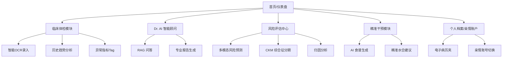

# Health AI Platform 2.0 产品需求文档 (PRD)

| 文档属性 | 内容 |
| :--- | :--- |
| **项目名称** | Health AI Platform (内部代号: Dr. AI) |
| **文档版本** | V2.0.1 |
| **产品负责人** | HealthAI Team |
| **涉及端** | Web 端 (Vue3 + Element Plus) / 后端 API (FastAPI) |
| **密级** | 内部绝密 |

---

## 1. 文档修订记录 (Revision History)

| 版本号 | 修改日期 | 修改人 | 修改描述 | 备注 |
| :--- | :--- | :--- | :--- | :--- |
| V1.0 | 2025-12-01 | HealthAI Team | 基础 MVP 版本，包含风险预测模型 | 已上线 |
| V2.0 | 2026-02-04 | HealthAI Team | 新增 OCR 智能录入、RAG 问答、全周期管理、亲情账户 | **当前版本** |

---

## 2. 项目背景与价值 (Background & Value)

### 2.1 现状与痛点 (User Pain Points)

1.  **数据孤岛与录入难**：用户的体检报告是纸质或 PDF，难以数字化，历史数据无法串联对比。
2.  **看不懂报告**：传统体检报告只有冷冰冰的箭头（↑↓），缺乏对"未来风险"的解读。
3.  **缺乏个性化方案**：通用的"少吃多动"建议无效，用户需要基于自身基因和代谢状态的精准方案。
4.  **家庭管理缺失**：子女难以实时掌握父母的健康细微变化。

### 2.2 产品定位 (Product Positioning)

**"您的全生命周期数字健康管家"**。

不是简单的记录工具，而是利用多模态 AI 技术，融合**基因+体检+行为数据**，提供从**风险预测**到**精准干预**闭环服务的医疗级平台。

### 2.3 商业价值 (Business Value)

*   **C 端**：通过 Freemium 模式，基础功能引流，高级功能（深度解读、亲情账户）订阅变现。
*   **B 端**：作为插件赋能体检中心，提升体检报告的附加值（由单纯的检测单升级为健康管理方案）。

---

## 3. 用户角色 (User Personas)

| 用户角色 | 特征描述 | 核心诉求 |
| :--- | :--- | :--- |
| **慢病高危人群** | 35-55岁，体检有异常项（脂肪肝、高血压），工作忙。 | 需要"秒懂"体检单，想要具体的改善方案（吃什么、喝什么）。 |
| **家庭守护者** | 25-40岁，父母异地居住，担心父母健康。 | 需要代父母管理档案，希望有异常时能收到预警。 |
| **量化自我极客** | 关注前沿科技，拥有基因检测数据。 | 希望看到深度的数据关联分析（如：基因如何影响了我的血糖）。 |
| **系统管理员** | 平台运维人员。 | 需要管理医学知识库（RAG），监控数据 ETL 状态。 |

---

## 4. 产品信息架构 (IA Structure)

---

## 5. 详细功能需求 (Functional Requirements)

### 5.1 核心业务流程：智能体检录入与分析

> **优先级：P0**

#### 5.1.1 需求描述

用户上传 PDF/图片体检单，系统自动识别并结构化数据，存入档案并触发风险计算。

#### 5.1.2 页面交互与逻辑

**上传入口**：支持拖拽上传，限制文件类型（PDF/JPG/PNG），最大 10MB。

**处理流程 (Backend)**：

1.  **预处理**：PDF 转高清图片（放大 2.0 倍），限制前 5 页（核心数据区）。
2.  **OCR**：并发调用百度高精度 OCR API。
3.  **提取**：调用 LLM (Kimi) 进行实体抽取，映射到标准字段（BMI, WBC 等）。
4.  **兜底**：若 LLM 失败，自动降级为正则提取；若 OCR 失败，提示手动录入。

**数据确认 (Frontend)**：

*   **智能合并**：仅覆盖有效数据，保留用户已填写数据。
*   **高亮反馈**：新填入的字段显示"绿色呼吸灯"特效。
*   **自动计算**：基于肌酐自动计算 eGFR（CKD-EPI 2021 公式）。

**异常检测**：

*   依据《中国体检人群参考区间》，自动标记异常项（红色 Tag）。
*   发现缺失项（如未查血糖），显示灰色占位符"报告中未找到"。

---

### 5.2 核心业务流程：Dr. AI 智能顾问 (RAG)

> **优先级：P0**

#### 5.2.1 需求描述

基于用户画像和医学指南的智能问答系统，拒绝 AI 幻觉。

#### 5.2.2 逻辑规范

*   **知识库构建**：后台管理 9 本权威指南 PDF，定期重建向量索引（ChromaDB）。
*   **上下文注入**：用户提问时，后端自动拼接用户当前的"异常指标"和"风险标签"。
*   **Prompt 示例**："用户尿酸 520，且有痛风史。基于《痛风食养指南》，回答：能吃海鲜吗？"
*   **引用溯源**：AI 回答必须标注"参考来源：《中国居民膳食指南 2022》"。
*   **缓存机制**：相同问题命中 Redis 缓存，实现 0 秒响应；支持"强制刷新"。

---

### 5.3 核心业务流程：全周期健康时光机

> **优先级：P1**

#### 5.3.1 需求描述

展示用户健康指标的时间变化趋势，并预测未来风险。

#### 5.3.2 功能细节

*   **电子病历夹**：按时间轴展示历史报告，支持在线预览 PDF（vue-pdf-embed），支持"一键载入"旧数据重测。
*   **趋势图表**：ECharts 展示 HbA1c、BMI、血压的折线图。
*   **未来推演**：
    *   基于当前趋势，模拟"5年后不干预"的风险值。
    *   模拟"干预后（减重 5%）"的风险收益。

---

### 5.4 辅助模块：精准干预与亲情账户

> **优先级：P2**

*   **AI 营养师**：基于 NHANES 膳食数据，结合 PuLP 线性规划，生成满足卡路里约束的食谱。
*   **亲情账户**：
    *   主账户可邀请父母手机号绑定。
    *   顶部导航栏支持"切换视角"，查看家人的数据大盘。
    *   **异常预警**：家人指标异常时，主账户收到 Notification。

---

## 6. 非功能性需求 (Non-functional Requirements)

### 6.1 性能要求

| 场景 | 要求 |
| :--- | :--- |
| OCR 响应 | 5 页 PDF 识别时间 < 8秒（通过并发线程池实现） |
| 风险计算 | 模型推理时间 < 200ms |
| 高并发 | LLM 调用需具备"指数退避重试"机制，防止 429 错误导致服务不可用 |

### 6.2 数据安全与隐私 (Security)

*   **字段加密**：数据库中 `real_name`, `id_card`, `genomic_data` 必须采用 AES 加密存储。
*   **匿名科研**：提供隐私开关，用户开启后，数据经脱敏（Hash ID）后才可用于模型迭代。
*   **本地化选项**：支持切换至本地 Ollama 模型，确保敏感数据不出内网。

### 6.3 数据埋点 (Tracking)

*   记录"OCR 识别成功率"、"食谱生成次数"、"Dr. AI 问答满意度"。

---

## 7. 运营与迭代计划 (Roadmap)

### Phase 1: 基础建设 (已完成)

- [x] 完成多模态风险引擎训练
- [x] 完成基础 OCR 与 RAG 问答

### Phase 2: 体验升级 (当前阶段)

- [x] 上线多页 PDF 识别与智能填表
- [x] 上线全周期趋势图与电子病历夹
- [x] 接入 NHANES 营养数据，升级食谱算法

### Phase 3: 商业化与生态 (未来 3 个月)

- [ ] **PDF 专业报告导出**：生成可打印的体检解读报告（引流利器）
- [ ] **主动干预系统**：基于 Celery 实现"天气+病史"的主动健康提醒
- [ ] **App 端适配**：开发 Flutter/UniApp 版本，对接手机摄像头

---

## 8. 附录：数据字典与标准

| 标准名称 | 来源 |
| :--- | :--- |
| 风险评估标准 | NHANES 2017-2020 模型参数 |
| 参考值标准 | 《中国体检人群参考区间》(WS/T 404-2012) |
| CKM 分期标准 | AHA 2023 科学声明 |

---

*文档生成时间: 2026-02-04*
